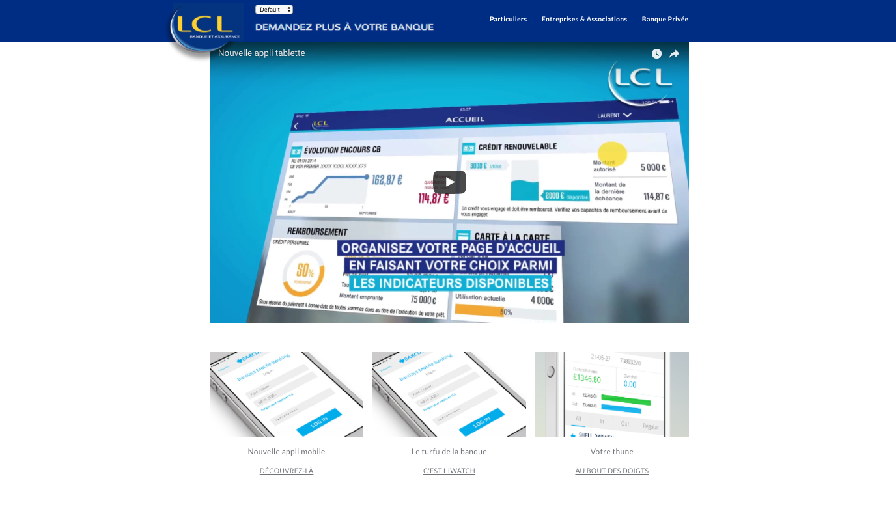
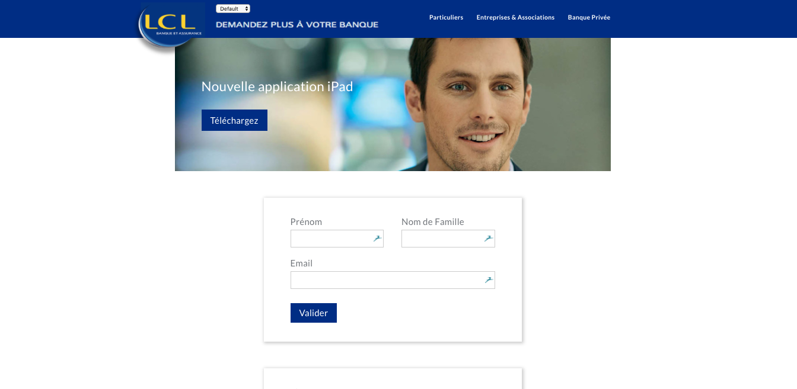

## Demo project for LCL

This demo is based off of the [prismic-demo](https://github.com/arnaudlewis/prismic-demo).

Here are the [prismic repository](https://lcl-landing-demo.prismic.io/documents/working/), the [live demo site](https://frozen-cove-89894.herokuapp.com), and the [live "development environment"](https://stormy-sea-16517.herokuapp.com). 

This demo used the normal demo slices while adding:
- CTA Banner
- An email form
- A dropdown to select user roles

------------------------------------

Here are some screenshots:

Landing Page 1

Landing Page 2

------------------------------------
### License

This software is licensed under the Apache 2 license, quoted below.

Copyright 2017 Prismic.io (http://prismic.io).

Licensed under the Apache License, Version 2.0 (the "License"); you may not use this project except in compliance with the License. You may obtain a copy of the License at http://www.apache.org/licenses/LICENSE-2.0.

Unless required by applicable law or agreed to in writing, software distributed under the License is distributed on an "AS IS" BASIS, WITHOUT WARRANTIES OR CONDITIONS OF ANY KIND, either express or implied. See the License for the specific language governing permissions and limitations under the License.
